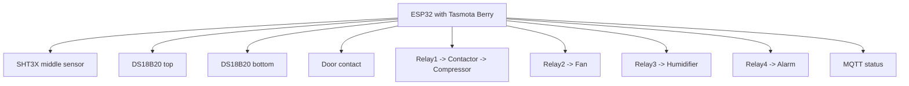
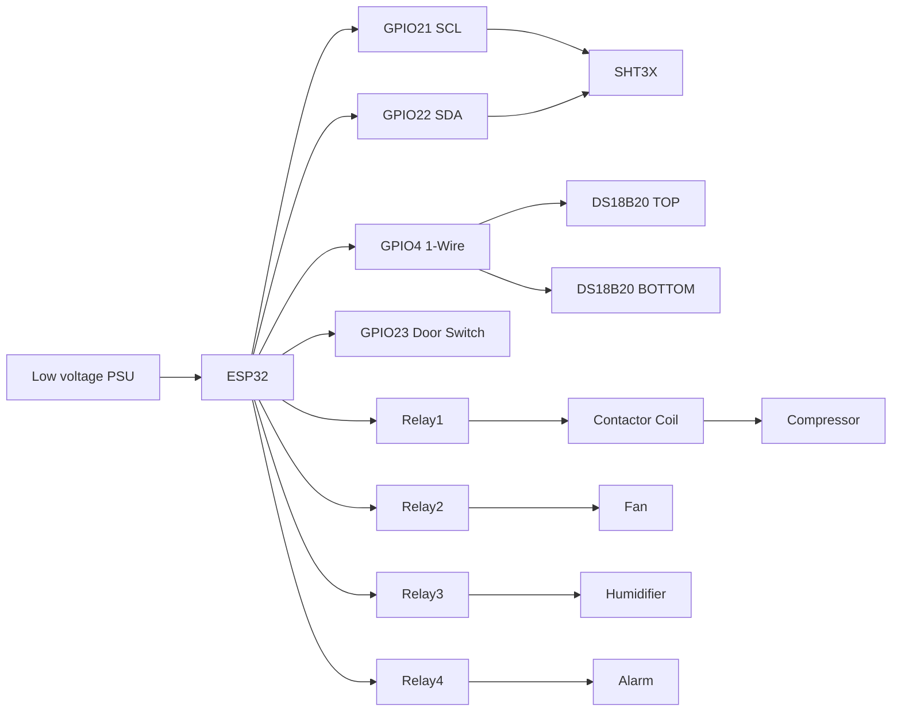
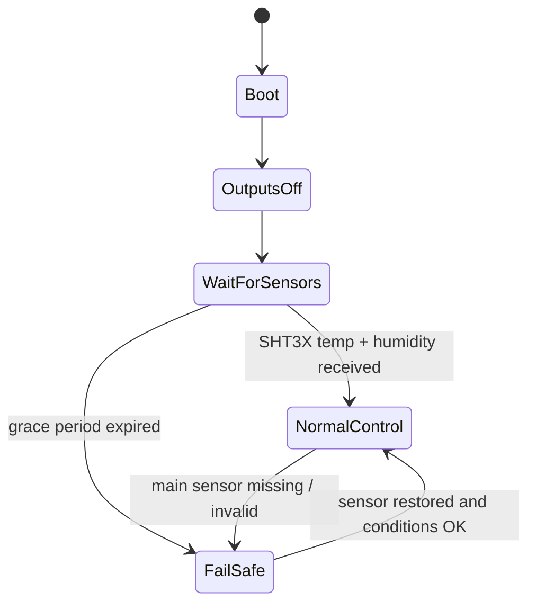

# Flower Cooler Controller
ESP32 + Tasmota + Berry automation for a flower cooler / flower fridge

This package contains:

- `src/autoexec.be` — the controller script for Tasmota Berry
- `README.md` — installation, wiring, safety, setup, verification, and operating guide

---

# 1. Purpose

This controller is designed for a flower cooler where the goals are:

- stable low temperature
- controlled humidity
- compressor protection
- startup-safe behavior
- fail-safe behavior if sensor data is missing
- simple field diagnostics through console commands and MQTT

The controller uses:

- **SHT30 / SHT3X** as the **main sensor** for middle temperature and humidity
- **DS18B20 top** shelf sensor
- **DS18B20 bottom** shelf sensor
- **door contact**
- **4 outputs**
  - compressor
  - circulation fan
  - humidifier
  - alarm

---

# 2. Safety and electrical warning

## This project switches mains-powered equipment

That means the low-voltage controller and the mains side must be treated separately.

## Mandatory hardware safety items

- Use a **contactor** to drive the compressor
- Do **not** connect the compressor motor directly to a small relay board
- Use correct fusing / breaker protection
- Use proper earthing / grounding
- Use an enclosure suitable for humid environments
- Keep mains wiring physically separated from ESP32 low-voltage wiring
- Use strain relief and insulated terminals
- Use relay modules with proper isolation

## Compressor output rule

**Relay1 must drive the contactor coil, not the compressor directly.**

---

# 3. System architecture



---

# 4. Hardware layout

## 4.1 Recommended physical layout

```text
+------------------------------------------------------+
|                    Flower Cooler                     |
|                                                      |
|   [Top shelf]      DS18B20 TOP                       |
|                                                      |
|   [Middle area]    SHT3X main temp + humidity        |
|                                                      |
|   [Bottom shelf]   DS18B20 BOTTOM                    |
|                                                      |
|   Door switch at frame                               |
|                                                      |
|   Fan in internal airflow path                       |
|                                                      |
+------------------------------------------------------+

Outside / electrical compartment:
- ESP32 dev board
- relay module
- compressor contactor
- power supply
- fuse / breaker
```

## 4.2 Recommended sensor roles

- **SHT3X** = main control sensor
- **Top DS18B20** = upper shelf monitoring / too-cold protection support
- **Bottom DS18B20** = lower shelf monitoring / airflow stratification support

---

# 5. ESP32 DevKit mapping

Recommended mapping for this version:

| ESP32 GPIO | Function |
|---|---|
| GPIO21 | I2C SCL |
| GPIO22 | I2C SDA |
| GPIO4  | DS18x20 |
| GPIO26 | Relay1 = compressor contactor |
| GPIO25 | Relay2 = fan |
| GPIO33 | Relay3 = humidifier |
| GPIO32 | Relay4 = alarm |
| GPIO23 | Door contact / Switch1 |

---

# 6. Wiring

## 6.1 SHT3X (I2C)

| SHT3X pin | ESP32 |
|---|---|
| VCC | 3.3V |
| GND | GND |
| SDA | GPIO21 |
| SCL | GPIO22 |

### Required pull-up resistors for I2C

Add pull-ups to **3.3V**:

- SDA -> **4.7kΩ** -> 3.3V
- SCL -> **4.7kΩ** -> 3.3V

Even if the module already contains pull-ups, verify the board. If cabling is longer, clean pull-up wiring matters.

---

## 6.2 DS18B20 (1-Wire)

Both DS18B20 sensors share the same data line.

| DS18B20 pin | ESP32 |
|---|---|
| VCC | 3.3V |
| GND | GND |
| DATA | GPIO4 |

### Required pull-up resistor for 1-Wire

Add:

- DATA -> **4.7kΩ** -> 3.3V

Without the 1-Wire pull-up, DS18B20 reliability will be poor.

---

## 6.3 Door contact

Use a magnetic reed contact or dry-contact switch.

Recommended wiring:

| Door contact | ESP32 |
|---|---|
| one side | GPIO23 |
| other side | GND |

Tasmota uses it as `Switch1`.

---

## 6.4 Relay outputs

| Relay | Controlled device |
|---|---|
| Relay1 | compressor contactor coil |
| Relay2 | internal fan |
| Relay3 | humidifier |
| Relay4 | alarm output |

---

## 6.5 Compressor contactor wiring concept

```text
ESP32 GPIO26
   -> Relay1 input
Relay1 output
   -> Contactor coil
Contactor power contacts
   -> Compressor mains supply
```

This means:

- ESP32 only controls relay logic
- relay only switches the contactor coil
- contactor switches the compressor load

---

# 7. Wiring diagram



---

# 8. Tasmota module setup

## 8.1 Flash Tasmota with Berry support
Use a Tasmota build that supports Berry scripting on ESP32.

## 8.2 Configure the device module
Use an ESP32 dev board template / generic ESP32 devkit.

## 8.3 Assign GPIOs

Set these in Tasmota Configure Module:

| GPIO | Tasmota function |
|---|---|
| GPIO21 | I2C SCL |
| GPIO22 | I2C SDA |
| GPIO4  | DS18x20 |
| GPIO26 | Relay1 |
| GPIO25 | Relay2 |
| GPIO33 | Relay3 |
| GPIO32 | Relay4 |
| GPIO23 | Switch1 |

## 8.4 Verify sensors
After saving GPIO mapping, verify:

- SHT3X appears
- DS18B20 sensors appear
- door switch changes state

Useful commands:

```text
I2CScan
Status 10
```

Expected examples:

- `SHT3X`
- `DS18B20-1`
- `DS18B20-2`

---

# 9. File system and script installation

Upload `autoexec.be` to the Tasmota file system.

Then run:

```text
BrRestart
```

After restart, the controller initializes.

---

# 10. Startup behavior

This version starts more safely.

## At boot

- All four outputs are forced **OFF**
- Controller enters **startup sensor wait**
- Controller waits for:
  - SHT3X temperature
  - SHT3X humidity

## During startup grace period

- no normal control starts yet
- no immediate fail-safe just because the sensor has not reported yet

## If sensor data arrives in time

- startup wait ends
- normal control begins

## If sensor data does not arrive in time

- fail-safe is entered

---

# 11. Startup state machine



---

# 12. Control logic overview

## Cooling
The middle SHT3X temperature is the main control input.

- if `t_mid >= cool_on`, cooling may start
- if `t_mid <= cool_off`, cooling may stop

But startup only occurs if compressor timing protections allow it.

## Humidity
The middle SHT3X humidity is the main humidity input.

- if `rh < hum_on`, humidifier may start
- if `rh > hum_off`, humidifier stops

Humidifier is also blocked during cooling lockout conditions.

## Fan
Fan runs:
- with compressor
- during post-run
- during mixing cycles
- in fail-safe

## Door
When door opens:
- humidifier stops immediately
- compressor may keep running for configured delay
- long-open alarm may latch

---

# 13. Protection logic included

This version includes:

- startup sensor wait
- startup compressor lockout
- compressor min OFF protection
- compressor min ON protection
- door-open compressor stop delay
- high temperature alarm
- door-open-too-long alarm
- max compressor runtime alarm
- humidifier post-cooling lockout
- too-cold latch
- fail-safe mode
- sensor timeout monitoring

---

# 14. Important parameters

## Core setpoints

| Parameter | Meaning |
|---|---|
| `cool_on` | start cooling threshold |
| `cool_off` | stop cooling threshold |
| `hum_on` | humidifier start threshold |
| `hum_off` | humidifier stop threshold |

## Compressor protection

| Parameter | Meaning |
|---|---|
| `min_comp_on_ms` | minimum compressor ON time |
| `min_comp_off_ms` | minimum compressor OFF time |
| `startup_comp_lockout_ms` | boot-time restart lockout |

## Startup / sensor protection

| Parameter | Meaning |
|---|---|
| `startup_sensor_grace_ms` | time allowed to receive required startup sensor data |
| `watchdog_timeout_ms` | missing sensor timeout |
| `sensor_stuck_timeout_ms` | sensor stuck detection timeout |

## Door behavior

| Parameter | Meaning |
|---|---|
| `door_recover_ms` | wait after door closes before control resumes |
| `door_open_comp_off_delay_ms` | compressor stop delay after door opens |
| `door_alarm_delay_ms` | long-open alarm threshold |

## Extra alarms

| Parameter | Meaning |
|---|---|
| `high_temp_alarm_on` | high-temp alarm threshold |
| `high_temp_alarm_off` | high-temp alarm reset threshold |
| `high_temp_alarm_delay_ms` | delay before high-temp alarm latches |
| `max_comp_runtime_ms` | maximum allowed compressor runtime before alarm |

---

# 15. Commands

All commands are entered as Tasmota console commands:

```text
FC <subcommand>
```

## Basic commands

```text
FC help
FC status
FC eval
FC save
```

### Meaning
- `FC help` -> show help
- `FC status` -> detailed current status
- `FC eval` -> run control logic now
- `FC save` -> persist settings

---

## Parameter changes

```text
FC set cool_on 5
FC set cool_off 4
FC set hum_on 82
FC set hum_off 87
FC set startup_sensor_grace_ms 60000
```

## Examples

```text
FC set min_comp_off_ms 300000
FC set door_open_comp_off_delay_ms 30000
FC set high_temp_alarm_on 8
FC set high_temp_alarm_delay_ms 900000
```

---

## Simulation commands

```text
FC simulate on
FC simulate off
FC simulate status
FC simulate top <degC>
FC simulate mid <degC>
FC simulate bottom <degC>
FC simulate hum <%RH>
FC simulate door open
FC simulate door closed
```

Simulation mode:
- forces outputs OFF before entering simulation
- lets you test logic without energizing real outputs
- set fake top/mid/bottom temperatures and humidity with `FC simulate top|mid|bottom|hum` (humidity is clamped to 0–100%)

---

## MQTT commands

```text
FC mqtt on
FC mqtt off
FC mqtt status
FC mqtt publish
```

Default topic:

```text
tele/flowercooler/status
```

---

## Bypass command

```text
FC bypass on
```

Bypass is denied if:
- too-cold latch active
- fail-safe active
- door open
- startup still waiting for sensor data

---

# 16. Tasmota initialization commands

```text
Backlog PowerOnState 0; TelePeriod 60; SwitchMode1 1
```

These are useful during first setup:

```text
I2CScan
Status 10
BrRestart
```


---

# 17. Pre-production verification checklist

Do **not** put this into unattended production until all checks below pass.

## 17.1 Electrical checks
- confirm compressor is switched through a contactor
- confirm relay output does not directly power compressor motor
- confirm all grounds / earths are correct
- confirm low-voltage and mains wiring are separated
- confirm enclosure is suitable

## 17.2 Sensor checks
- SHT3X reports stable temperature and humidity
- both DS18B20 sensors report stable values
- disconnect / reconnect sensors and confirm expected behavior

## 17.3 Startup checks
1. power cycle controller
2. immediately run:

```text
FC status
```

Expected:
- outputs OFF
- `startup_waiting_for_sensors=true`
- no immediate fail-safe

Then after first SHT3X updates:
- `startup_waiting_for_sensors=false`

## 17.4 Door checks
- open door
- verify humidifier stops immediately
- verify compressor stop delay is respected
- verify long-open alarm behavior

## 17.5 Compressor protection checks
- force cooling demand
- verify compressor does not short-cycle
- verify minimum OFF time is respected
- verify minimum ON time is respected

## 17.6 Fail-safe checks
- disconnect main SHT3X signal / sensor
- verify fail-safe behavior:
  - compressor OFF
  - humidifier OFF
  - fan ON
  - alarm ON

## 17.7 Simulation checks
- enter simulation mode
- verify all outputs are forced OFF
- test simulated temperatures / humidity / door states
- verify logs match expected decisions

---

# 18. Suggested commissioning procedure

1. Wire low-voltage side only
2. Verify sensors in Tasmota
3. Verify door input
4. Verify relay outputs without mains load
5. Verify contactor switching separately
6. Upload script
7. Reboot and observe startup behavior
8. Run simulation tests
9. Run live no-load logic tests
10. Connect compressor contactor load only after all tests pass

---

# 19. Troubleshooting

## Problem: immediate fail-safe after boot
Check:
- SHT3X seen in Tasmota
- `mid_seen`
- `hum_seen`
- `startup_sensor_grace_ms`

## Problem: compressor never starts
Check:
- startup still waiting for sensors
- compressor timing protections
- current `t_mid`
- door state
- fail-safe

## Problem: DS18B20 missing
Check:
- 1-Wire pull-up resistor 4.7kΩ
- correct GPIO assignment
- correct wiring polarity
- sensor bus quality

## Problem: SHT3X missing
Check:
- SDA/SCL pull-ups
- I2C wiring
- I2C address / board
- `I2CScan`

---

# 20. Example production settings

These are only starting points. Tune for your actual cooler.

```text
FC set cool_on 5
FC set cool_off 4
FC set hum_on 82
FC set hum_off 87
FC set min_comp_on_ms 180000
FC set min_comp_off_ms 300000
FC set door_open_comp_off_delay_ms 30000
FC set startup_sensor_grace_ms 60000
FC save
```

---

# 21. Package contents

- `src/autoexec.be`
- `README.md`
